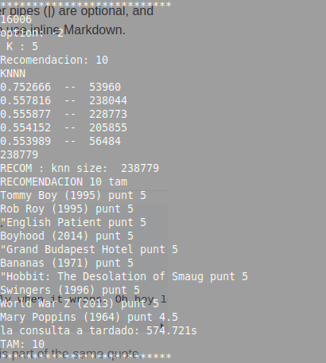
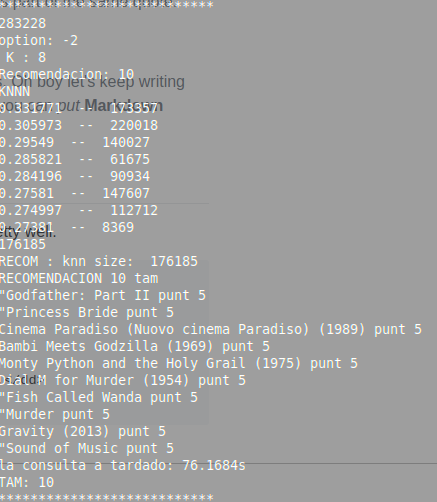
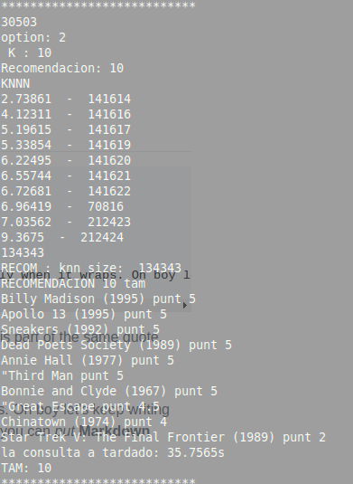
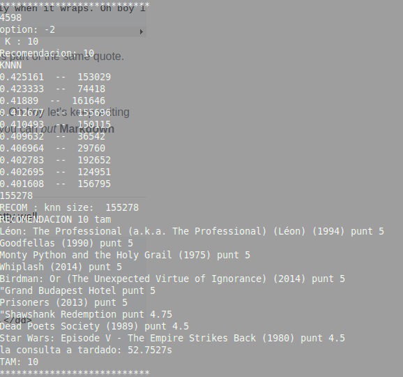

# Sistema-de-Recomendacion-MovieLens
   **Edson Lipa y Christian Condori**
#### replicar o ejecutar
1. para poder replicar el proyecto , se debe descargar la base de datos [Movielens](https://grouplens.org/datasets/movielens/latest/) y descomprimirla. 
1. dar permisos al ejecutable 
    
        chmod +x test
1. Ejecujar el programa con el input y obtener los archivos en arvhivo output 
         
         ./test < input > output
## Base de Datos
   Utilizamos la base de datos [Movielens](https://grouplens.org/datasets/movielens/latest/).
   Versión Completa : 27,000,000 calificaciones y 1,100,000 aplicaciones de etiquetas aplicadas a 58,000 películas por 280,000 usuarios. Incluye datos del genoma de la etiqueta con 14 millones de puntuaciones de relevancia en 1.100 etiquetas. Última actualización 9/2018.

    ml-latest.zip  (tamaño: 265 MB)

## Almacenamiento y levantamiento de la base de datos
   Nosotros Logramos Cargar La base de datos de movielens de 27 millones, en 110 segundos y ocupando un espacio en memoria ram de 2.1 Gb 
## Implementación del KNN (Proceso)
  Estamos utilizando las Distancias Vistas en clase:
  - Distancia Euclidiana
  - Distancia de Manhattan
  - Correlacion de Pearson
  - Distancia del Coseno
  para obtener los Knn obtenemos las distancias de un usuario dado con cada uno de los usuarios existentes que tengan recomendaciones. 
## Lenguaje de Programación + Librarías
Desarrollamos el Programa en c++, junto con la libreria OpenMP para paralelizar el algoritmo KNN
## Proceso del Sistema de Recomendación
1. Primero cargamos la data en un map de map esto nos demora 110 seg aproximadamente, y ocupamos 2.1 GB s 
1. Después, dado un usuario dado y un k para los primero k usuarios
1. en este punto podemos hacer una recomendación de películas al usario o dado una película podemos dar una proyección de la puntuación de esta película según los usarios compatibles que ya hayan visto dicha película.
## Pruebas
### Input 
   En el archivo input podemos ver los casos de prueba separados por espacios
   - El primer codigo, el el codigo del usuario
   - Seguido por la distancia >pearson coseno Euclidiana o Manhattan
   - Enseguida los k usuarios (para el algoritmo de knn)
   - por ultimo, las  n peliculas a recomendar (si no se tiene suficientes películas se recomienda todas las que resulten)
##### Ejemplo
       16006
       -1 5 10
      283228
       -2 8 10
      30503
       2 10 10
      4598
       -1 10 10
      16006
       -2 5 10
      283228
       -2 8 10
      30503
       2 10 10
      4598
       -2 10 10
### Output
      la carga de datos a tardado: 111.889s
      START: 
      16006
      option: -1
       K : 5
      Recomendacion: 10
      KNNN
      1.00003  --  123250
      1.00001  --  136420
      1.00001  --  130242
      1.00001  --  140141
      1.00001  --  51639
      207854
      RECOM : knn size:  207854
      RECOMENDACION 10 tam 
      Dancer in the Dark (2000) punt 5
      "Equalizer punt 5
      Simple Simon (I rymden finns inga känslor) (2010) punt 4.5
      Juno (2007) punt 4.5
      "Beautiful Mind punt 4.5
      Interstellar (2014) punt 4.5
      Schindler's List (1993) punt 4
      Needful Things (1993) punt 3
      Sherlock: The Abominable Bride (2016) punt 2.5
      "Streetcar Named Desire punt 2
      la consulta a tardado: 67.2195s
      TAM: 10

   En el Archivo Output podemos encontrar la salida de los casos de prueba
      - aqui podemos observar que el usario 1006
      - con la distacia de pearson 
      - un K de 5
      - 10 como el numero de peliculas a recomendar 
      - seguido de la imprecion de los k usarios mas cercanos      
      - seguido por la recomendacion de peliculas con nombre y puntaje
   como ultimo en la penúltima linea antes de la linea punteada **************
   tenemos el tiempo de consulta que varia dependiendo de cada usuario, para este ejemplo obtuvimos 67.2195s para la obtención de los knn y la recomendación
   **El archivo output contiene el resultado de todas las pruebas, demasiado grande para mostrar cada una**
###### Conclusión
Los primeros 4 usuarios y distancias estas hechas para comprobar los knn de cada usario, los 4 usuarios siguientes realizaron el algoritmo knn con la distancia coseno, ya que al analizar la base de datos contiene datos muy esparsos lo que nos da distancias iguales, de 3 a 15 primeros usarios tienen 1 como distancia, con la distancia de pearson, asi que preferimos optar por la distancia del coseno ya que tiene mejores resultados para bases de datos esparsas.

| USUARIO |OPCION (distancia)| K | N |TIEMPO DE CONSULTA (segundos)|
| ----- | ---- | ---- | ---- | ---- |
| 16006 | -1(pearson) | 5 | 10 | 67.2195|
| 283228 | -2(coseno) | 8 | 10 | 74.0309 |
| 30503 | 2(euclidiana) | 10 | 10 | 34.8503 |
| 4598 | -1(pearson) |  10| 10 | 34.9638 |
| 16006 | -2(coseno) | 5 | 10 | 574.721 |
| 283228 | -2(coseno) | 8 | 10 | 76.1684s |
| 30503 | -2(coseno) | 2 | 10 | 35.7565 |
| 4598 | -2(coseno) | 10 | 10 | 52.7527 |
###### Recomendaciones con la Distancia del Coseno
- para el usuaro 16006

 
   
        Tommy Boy (1995) punt 5
        Rob Roy (1995) punt 5
        "English Patient punt 5
        Boyhood (2014) punt 5
        "Grand Budapest Hotel punt 5
        Bananas (1971) punt 5
        "Hobbit: The Desolation of Smaug punt 5
        Swingers (1996) punt 5
        World War Z (2013) punt 5
        Mary Poppins (1964) punt 4.5
        la consulta a tardado: 574.721s

- para el usuaro 283228

 
       
      "Godfather: Part II punt 5
      "Princess Bride punt 5
      Cinema Paradiso (Nuovo cinema Paradiso) (1989) punt 5
      Bambi Meets Godzilla (1969) punt 5
      Monty Python and the Holy Grail (1975) punt 5
      Dial M for Murder (1954) punt 5
      "Fish Called Wanda punt 5
      "Murder punt 5
      Gravity (2013) punt 5
      "Sound of Music punt 5
      la consulta a tardado: 76.1684s
      
- para el usuaro 30503

 

    Billy Madison (1995) punt 5
    Apollo 13 (1995) punt 5
    Sneakers (1992) punt 5
    Dead Poets Society (1989) punt 5
    Annie Hall (1977) punt 5
    "Third Man punt 5
    Bonnie and Clyde (1967) punt 5
    "Great Escape punt 4.5
    Chinatown (1974) punt 4
    Star Trek V: The Final Frontier (1989) punt 2
    la consulta a tardado: 35.7565s

- para el usuaro 4598

 
 
    Léon: The Professional (a.k.a. The Professional) (Léon) (1994) punt 5
    Goodfellas (1990) punt 5
    Monty Python and the Holy Grail (1975) punt 5
    Whiplash (2014) punt 5
    Birdman: Or (The Unexpected Virtue of Ignorance) (2014) punt 5
    "Grand Budapest Hotel punt 5
    Prisoners (2013) punt 5
    "Shawshank Redemption punt 4.75
    Dead Poets Society (1989) punt 4.5
    Star Wars: Episode V - The Empire Strikes Back (1980) punt 4.5
    la consulta a tardado: 52.7527s

   
## informe 
  para un informe mas detallado de la estructura puede revisar [ informe ](paper.pdf)
